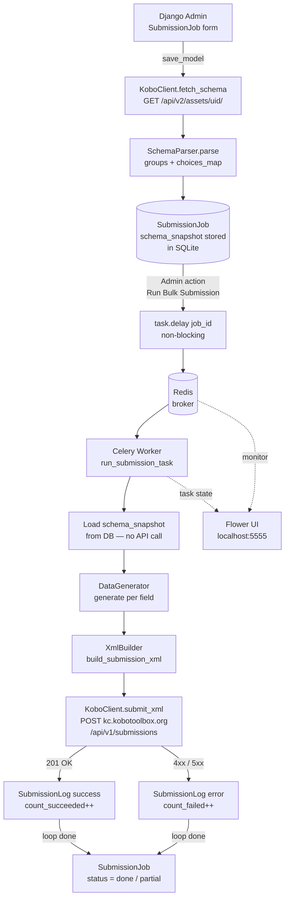
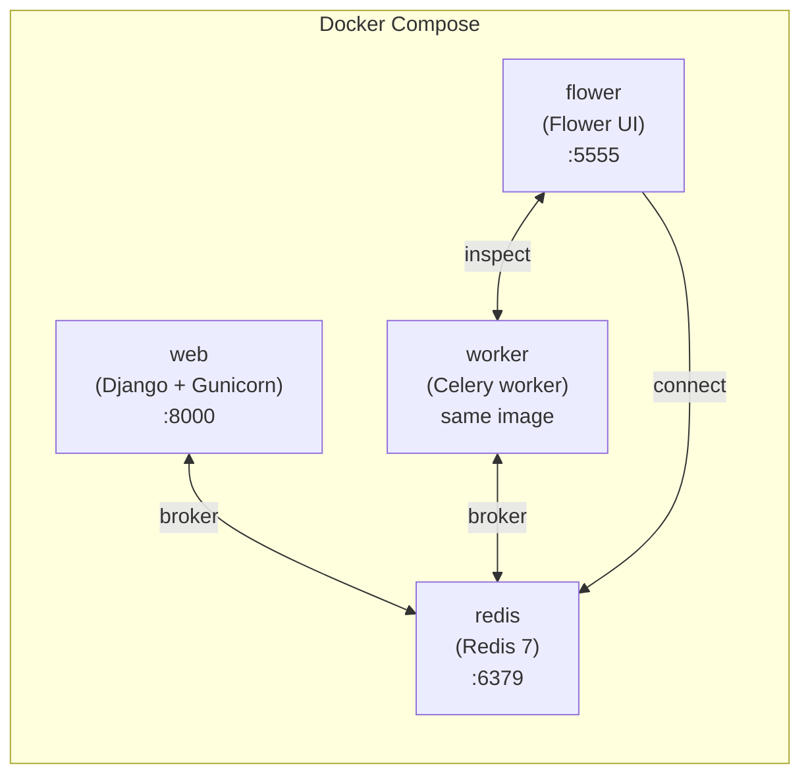
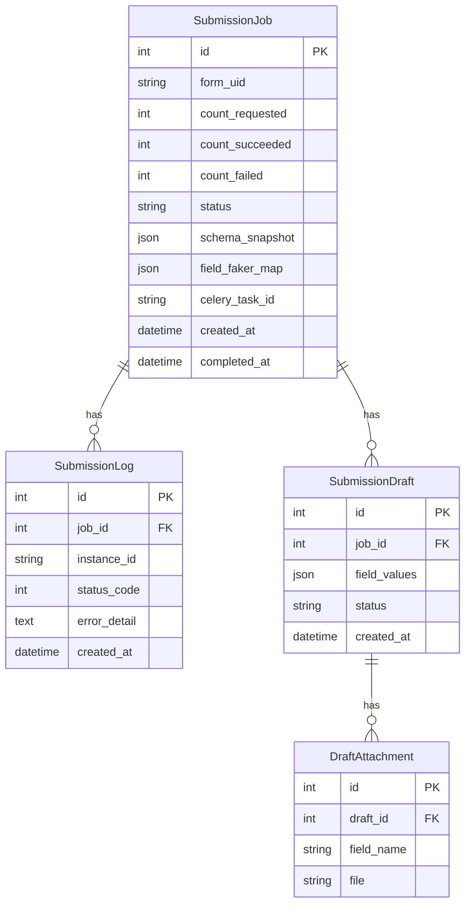
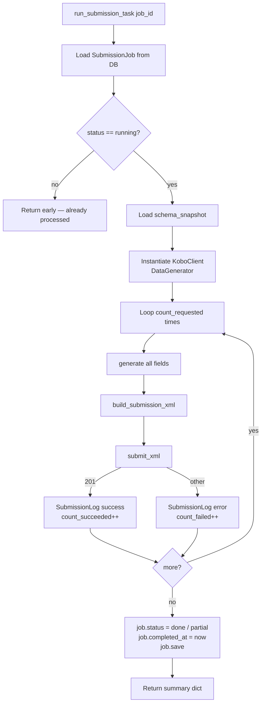
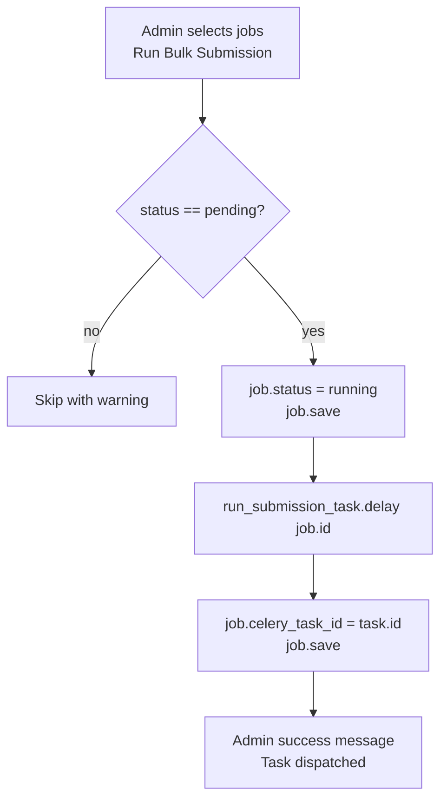
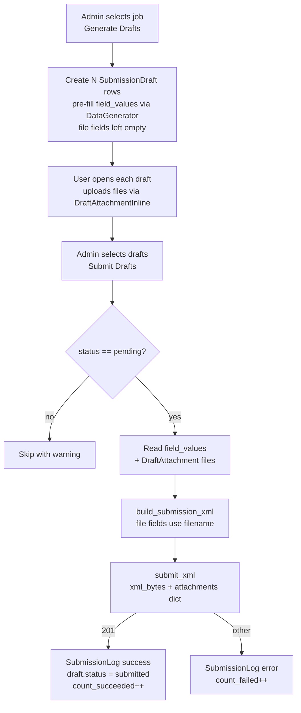

# Dummy Generator — Design Specification

## Overview

Django app (`dummygenerator`) that generates and bulk-submits realistic dummy
data to any KoboToolbox form via the OpenRosa XML submission API using Basic Auth.

The form schema is fetched from the Kobo API once at job creation and stored on
the job record. Submission batches are processed asynchronously by a Celery
worker, monitored via Flower.

**Scope**: 1–50 submissions per batch, async via Celery, triggered from Django admin.

---

## System Architecture



---

## Docker Compose Services



**Service definitions**:

| Service | Image | Command | Port |
|---|---|---|---|
| `web` | custom (Dockerfile) | `gunicorn koboapi.wsgi` | 8000 |
| `worker` | same as `web` | `celery -A koboapi worker -l info` | — |
| `flower` | same as `web` | `celery -A koboapi flower` | 5555 |
| `redis` | `redis:7-alpine` | default | 6379 |

---

## File Structure

```
koboapi/                         ← Django project root
├── koboapi/
│   ├── settings.py
│   ├── urls.py
│   └── celery.py                ← Celery app config (new)
├── dummygenerator/
│   ├── __init__.py
│   ├── apps.py
│   ├── models.py                # SubmissionJob, SubmissionLog
│   ├── services.py              # KoboClient, SchemaParser, DataGenerator, XmlBuilder
│   ├── tasks.py                 # Celery task: run_submission_task (new)
│   ├── admin.py                 # Admin registration + actions
│   ├── migrations/
│   └── tests.py
├── Dockerfile
├── docker-compose.yml
├── .env
└── requirements.txt
```

---

## Data Models



### `SubmissionJob`

| Field | Type | Notes |
|---|---|---|
| `id` | AutoField PK | — |
| `form_uid` | CharField(64) | e.g. `a3ytas3GLhSewNTZByCCsd` |
| `count_requested` | PositiveSmallIntegerField | 1–50 |
| `count_succeeded` | PositiveSmallIntegerField | default 0 |
| `count_failed` | PositiveSmallIntegerField | default 0 |
| `status` | CharField choices | `pending / running / done / partial / failed` |
| `schema_snapshot` | JSONField | parsed schema stored at save |
| `field_faker_map` | JSONField | `{field_name: faker_type}` for text fields; set by user in admin |
| `celery_task_id` | CharField(64) null/blank | ID returned by `.delay()` |
| `created_at` | DateTimeField auto_now_add | — |
| `completed_at` | DateTimeField null/blank | set on finish |

**`schema_snapshot` structure**:

```json
{
  "form_uid": "a3ytas3GLhSewNTZByCCsd",
  "version_id": "vHpEzLVEovyTBPF7bgCHsd",
  "groups": [
    {
      "name": "group_yc81a25",
      "fields": [
        {"name": "A1_Name_of_citizen_Libito_laso_Science", "type": "text", "list_name": null},
        {"name": "A2_Name_of_constitu_ndla_lokubikwa_ngayo", "type": "text", "list_name": null}
      ]
    }
  ],
  "choices_map": {
    "do2ug34": ["1__bs___blue_swallows_appearance__tinkon", "2__sg___southern_ground_hornbill_calling"],
    "bz2rx27": ["1__appearance_of_just_a_few__kubonakala_", "2__high_influx__kubonakala_letinyenti_le"]
  }
}
```

Fields with no group (`start`, `end`) go in a synthetic `"__root__"` group and
render directly under the root XML element.

### `SubmissionLog`

| Field | Type | Notes |
|---|---|---|
| `id` | AutoField PK | — |
| `job` | ForeignKey(SubmissionJob) | on_delete=CASCADE |
| `instance_id` | CharField(64) | UUID assigned to this submission |
| `status_code` | PositiveSmallIntegerField null | HTTP response code |
| `error_detail` | TextField blank | response body on failure |
| `created_at` | DateTimeField auto_now_add | — |

### `SubmissionDraft` (Step 9)

| Field | Type | Notes |
|---|---|---|
| `id` | AutoField PK | — |
| `job` | ForeignKey(SubmissionJob) | on_delete=CASCADE |
| `field_values` | JSONField | non-file fields pre-filled by `DataGenerator` |
| `status` | CharField choices | `pending / submitted / skipped` |
| `created_at` | DateTimeField auto_now_add | — |

### `DraftAttachment` (Step 9)

| Field | Type | Notes |
|---|---|---|
| `id` | AutoField PK | — |
| `draft` | ForeignKey(SubmissionDraft) | on_delete=CASCADE |
| `field_name` | CharField(128) | matches field name in schema (e.g. `photo_of_site`) |
| `file` | FileField | `upload_to='draft_attachments/'` |

---

## Services (`services.py`)

### `KoboClient`

```python
class KoboClient:
    def __init__(self, base_url: str, kc_url: str, username: str, password: str) -> None: ...

    def fetch_schema(self, form_uid: str) -> dict:
        """GET /api/v2/assets/{form_uid}/?format=json
        Raises requests.HTTPError on non-2xx.
        """

    def submit_xml(self, xml_bytes: bytes, attachments: dict[str, bytes] = {}) -> tuple[int, str]:
        """POST xml_bytes to {kc_url}/api/v1/submissions as multipart.
        attachments: mapping of filename → file bytes for file fields.
        Returns (status_code, response_text).
        """
```

- Auth: `requests.auth.HTTPBasicAuth(username, password)`
- Submit endpoint: `POST https://kc.kobotoolbox.org/api/v1/submissions`
- Multipart field name: `xml_submission_file`
- Expected success: HTTP 201

---

### `SchemaParser`

```python
def parse_schema(api_response: dict) -> dict:
    """Extract groups, fields, choices_map from a Kobo asset API response."""
```

**Parsing rules for `content.survey`**:

| Row `type` | Action |
|---|---|
| `begin_group` | Push group name onto stack |
| `end_group` | Pop group from stack |
| `start` / `end` | Add to `__root__` group |
| any other supported type | Add to current group (or `__root__` if no open group) |

**Skipped types** (auto-submission path): `image`, `audio`, `video`, `file`, `note`, `begin_repeat`, `end_repeat`.

**Retained types** (draft + file upload path, Step 9): `image`, `audio`, `video`, `file` are kept and marked `"is_file": True` in the field dict so `XmlBuilder` can reference them by filename.

---

### `DataGenerator`

```python
FAKER_TYPE_CHOICES = [
    ("name",         "Name"),
    ("first_name",   "First name"),
    ("last_name",    "Last name"),
    ("phone_number", "Phone number"),
    ("email",        "Email"),
    ("address",      "Address"),
    ("city",         "City"),
    ("country",      "Country"),
    ("company",      "Company"),
    ("url",          "URL"),
    ("sentence",     "Sentence"),
    ("paragraph",    "Paragraph"),
    ("random_int",   "Number (1–9999)"),
]

class DataGenerator:
    def __init__(self, choices_map: dict[str, list[str]], locale: str = "en_US") -> None: ...

    def generate(self, field_type: str, list_name: str | None, faker_type: str | None = None) -> str:
        """Return a single string value for the given field type.
        faker_type: key from FAKER_TYPE_CHOICES; only applied when field_type == 'text'.
        """
```

| `field_type` | Strategy |
|---|---|
| `text` | call `_faker_dispatch(faker_type)` if `faker_type` set; else `faker.sentence(nb_words=4)` |
| `integer` | `str(random.randint(1, 100))` |
| `decimal` | `str(round(random.uniform(1.0, 100.0), 2))` |
| `select_one` | `random.choice(choices_map[list_name])` |
| `select_multiple` | `" ".join(random.sample(pool, k=random.randint(1, len(pool))))` |
| `date` | `faker.date_between("-1y", "today").isoformat()` |
| `datetime` | `faker.date_time_between("-1y", "now").isoformat() + "+00:00"` |
| `geopoint` | `f"{faker.latitude()} {faker.longitude()} 0 0"` |
| `start` / `end` | current UTC datetime as ISO string |
| unknown / unsupported | `""` (field omitted from XML) |

**`_faker_dispatch(faker_type)`** maps each `FAKER_TYPE_CHOICES` key to a Faker call:

| `faker_type` | Faker call |
|---|---|
| `name` | `faker.name()` |
| `first_name` | `faker.first_name()` |
| `last_name` | `faker.last_name()` |
| `phone_number` | `faker.phone_number()` |
| `email` | `faker.email()` |
| `address` | `faker.address()` |
| `city` | `faker.city()` |
| `country` | `faker.country()` |
| `company` | `faker.company()` |
| `url` | `faker.url()` |
| `sentence` | `faker.sentence()` |
| `paragraph` | `faker.paragraph()` |
| `random_int` | `str(random.randint(1, 9999))` |

---

### `XmlBuilder`

```python
def build_submission_xml(
    form_uid: str,
    version_id: str,
    groups: list[dict],
    field_values: dict[str, str],
) -> bytes:
    """Build OpenRosa XML bytes for one submission instance."""
```

Output structure:

```xml
<?xml version='1.0' ?>
<data id="{form_uid}" version="{version_id}">
  <{group_name}>
    <{field_name}>{value}</{field_name}>
  </{group_name}>
  <start>{iso_datetime}</start>
  <end>{iso_datetime}</end>
  <meta>
    <instanceID>uuid:{uuid4}</instanceID>
  </meta>
</data>
```

- Empty value fields are omitted.
- `__root__` fields render directly under `<data>`, no wrapper element.
- Library: `xml.etree.ElementTree` (stdlib).

---

## Celery Task (`tasks.py`)

```python
@shared_task(bind=True)
def run_submission_task(self, job_id: int) -> dict:
    """Process all submissions for a SubmissionJob."""
```



---

## Admin Interface (`admin.py`)

### `SubmissionJobAdmin`

- **List display**: `form_uid`, `count_requested`, `count_succeeded`, `count_failed`, `status`, `celery_task_id`, `created_at`
- **Read-only on detail**: `status`, `count_succeeded`, `count_failed`, `celery_task_id`, `completed_at`, `schema_snapshot`
- **`save_model` override**: on new job, call `fetch_schema` → `parse_schema` → store `schema_snapshot`; raise `ValidationError` on API failure
- **Field Faker Configuration widget**: rendered below the standard fields on the job detail page; reads `schema_snapshot.groups` to build a per-field table:
  - Text fields → dropdown of `FAKER_TYPE_CHOICES`; saved into `field_faker_map`
  - Non-text fields (`select_one`, `geopoint`, etc.) → displayed as read-only type label, excluded from `field_faker_map`
  - Widget pre-selects existing `field_faker_map` values on re-open
- **Actions**:
  - `run_bulk_submission` — dispatch `run_submission_task.delay(job.id)`, store `celery_task_id`
  - `refresh_schema` — re-fetch and overwrite `schema_snapshot`

**Field Faker Configuration layout** (job detail page):

```
Field Faker Configuration
┌──────────────────────────────────────────────────────────┐
│ Field name                    │ Type       │ Faker type   │
│───────────────────────────────│────────────│──────────────│
│ A1_Name_of_citizen            │ text       │ [name     ▾] │
│ A2_Phone_number               │ text       │ [phone_.. ▾] │
│ A3_Email                      │ text       │ [email    ▾] │
│ A4_GPS_location               │ geopoint   │ (fixed)      │
│ A5_Species                    │ select_one │ (fixed)      │
│ A6_Observations               │ text       │ [sentence ▾] │
└──────────────────────────────────────────────────────────┘
```

### Action flow



---

## Configuration

### `.env`

```dotenv
KOBO_BASE_URL=https://kf.kobotoolbox.org
KOBO_KC_URL=https://kc.kobotoolbox.org
KOBO_USERNAME=your_username
KOBO_PASSWORD=your_password

CELERY_BROKER_URL=redis://redis:6379/0
CELERY_RESULT_BACKEND=redis://redis:6379/0
```

### `koboapi/celery.py`

```python
import os
from celery import Celery

os.environ.setdefault("DJANGO_SETTINGS_MODULE", "koboapi.settings")
app = Celery("koboapi")
app.config_from_object("django.conf:settings", namespace="CELERY")
app.autodiscover_tasks()
```

### `koboapi/settings.py` additions

```python
CELERY_BROKER_URL = os.environ.get("CELERY_BROKER_URL", "redis://localhost:6379/0")
CELERY_RESULT_BACKEND = os.environ.get("CELERY_RESULT_BACKEND", "redis://localhost:6379/0")
CELERY_TASK_SERIALIZER = "json"
CELERY_RESULT_SERIALIZER = "json"
CELERY_ACCEPT_CONTENT = ["json"]
```

---

## Dependencies

```
django>=5.2
requests>=2.32
Faker>=26.0
python-dotenv>=1.0
celery>=5.4
redis>=5.0
flower>=2.0
gunicorn>=22.0
```

---

## Docker

### `Dockerfile`

```dockerfile
FROM python:3.12-slim
WORKDIR /app
COPY requirements.txt .
RUN pip install --no-cache-dir -r requirements.txt
COPY . .
```

### `docker-compose.yml`

```yaml
services:
  redis:
    image: redis:7-alpine

  web:
    build: .
    command: gunicorn koboapi.wsgi:application --bind 0.0.0.0:8000
    ports: ["8000:8000"]
    env_file: .env
    depends_on: [redis]

  worker:
    build: .
    command: celery -A koboapi worker --loglevel=info
    env_file: .env
    depends_on: [redis]

  flower:
    build: .
    command: celery -A koboapi flower --port=5555
    ports: ["5555:5555"]
    env_file: .env
    depends_on: [redis, worker]
```

---

## Draft + File Upload Workflow (Step 9)



**Multipart POST structure** for a draft with one image field:

```
POST /api/v1/submissions
  xml_submission_file  → <data id="..."><photo_of_site>photo.jpg</photo_of_site>...</data>
  photo.jpg            → <binary image bytes>
```

Kobo matches the attachment by filename — the XML element value must equal the uploaded file's name.

---

## Error Handling

| Scenario | Behaviour |
|---|---|
| HTTP 201 on submit | Record success, continue loop |
| HTTP 4xx / 5xx on submit | Log to `SubmissionLog`, continue loop |
| `requests.ConnectionError` on submit | Log `status_code=None`, mark job `failed`, stop loop |
| API error on schema fetch (`save_model`) | Raise `ValidationError` — job not saved |
| Job not in `pending` when action runs | Admin skips with warning message |
| `list_name` not in `choices_map` | `generate()` returns `""`, field omitted from XML |

---

## Security

- Credentials in `.env` only — never in DB or source code
- `schema_snapshot` contains no credentials
- `SECRET_KEY` must be rotated before any non-local deployment
- `db.sqlite3` gitignored

---

## Out of Scope (v1 auto-submission)

- Per-submission Celery tasks (one task per job)
- Multi-instance credential management (one `.env` per deployment)
- Repeat groups (`begin_repeat` / `end_repeat`)

> File attachments (`image`, `audio`, `video`, `file`) are handled in the manual draft path (Step 9), not in the auto-submission Celery flow.
