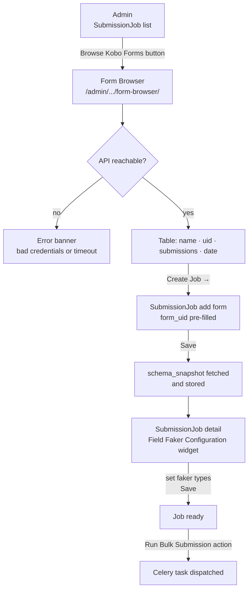
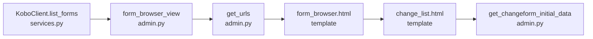

# Form Browser — Design & Implementation Plan

## Overview

Add a **Kobo Form Browser** page inside Django admin so users can list all
survey forms available in their Kobo account, pick one, and land on a
pre-filled `SubmissionJob` create form — eliminating the need to copy-paste
form UIDs manually.

The **Field Faker Configuration** widget already lives on the `SubmissionJob`
detail page (after the first save). This document adds the missing front door:
form discovery.

**Scope**: read-only admin view, no new models, no new migrations.

---

## User Flow



---

## Where the Faker Field Config Lives (reference)

The **Field Faker Configuration** table appears automatically on the
`SubmissionJob` **edit/detail page** after the first save:

```
/admin/dummygenerator/submissionjob/<id>/change/
```

```
Field Faker Configuration
┌──────────────────────────────────────────────────────────┐
│ Field name                    │ Type       │ Faker type   │
│───────────────────────────────│────────────│──────────────│
│ A1_Name_of_citizen            │ text       │ [name     ▾] │
│ A2_Phone_number               │ text       │ [phone_.. ▾] │
│ A3_Email                      │ text       │ [email    ▾] │
│ A4_GPS_location               │ geopoint   │ (fixed)      │
│ A5_Species                    │ select_one │ (fixed)      │
│ A6_Observations               │ text       │ [sentence ▾] │
└──────────────────────────────────────────────────────────┘
```

---

## File Structure (changes only)

```
dummygenerator/
├── services.py              ← add KoboClient.list_forms()
├── admin.py                 ← add get_urls(), form_browser_view(),
│                                get_changeform_initial_data()
└── templates/admin/dummygenerator/submissionjob/
    ├── change_form.html     ← existing (unchanged)
    ├── change_list.html     ← new: adds "Browse Kobo Forms" button
    └── form_browser.html    ← new: form listing page
```

---

## Service Addition (`services.py`)

### `KoboClient.list_forms`

```python
def list_forms(self) -> list[dict]:
    """GET /api/v2/assets/?asset_type=survey&format=json
    Follows pagination. Returns one dict per form with keys:
      uid, name, date_modified, has_deployment,
      deployment__submission_count.
    Raises requests.HTTPError on non-2xx.
    """
```

- Endpoint: `GET {base_url}/api/v2/assets/?asset_type=survey&format=json`
- Paginate via `next` field in response until `None`
- Extract only: `uid`, `name`, `date_modified`, `has_deployment`,
  `deployment__submission_count`

---

## Admin Changes (`admin.py`)

### `SubmissionJobAdmin.get_urls()`

Register one custom route inside the existing admin URL namespace:

```python
path(
    "form-browser/",
    self.admin_site.admin_view(self.form_browser_view),
    name="dummygenerator_form_browser",
)
```

### `SubmissionJobAdmin.form_browser_view(request)`

```
GET  /admin/dummygenerator/submissionjob/form-browser/
```

| Step | Action |
|---|---|
| 1 | Instantiate `KoboClient.from_env()` |
| 2 | Call `list_forms()` |
| 3 | On `HTTPError` / `ConnectionError`: render with `error` context |
| 4 | Render `form_browser.html` with `forms` list |

Context passed to template:

| Key | Value |
|---|---|
| `forms` | list of form dicts from `list_forms()` |
| `opts` | `self.model._meta` (for breadcrumbs) |
| `title` | `"Kobo Form Browser"` |
| `error` | error message string, or `None` |

### `SubmissionJobAdmin.get_changeform_initial_data(request)`

Pre-fill `form_uid` when arriving from the form browser:

```python
def get_changeform_initial_data(self, request):
    data = super().get_changeform_initial_data(request)
    if uid := request.GET.get("form_uid"):
        data["form_uid"] = uid
    return data
```

---

## Templates

### `change_list.html` (new)

Extends `admin/change_list.html`. Adds a **Browse Kobo Forms** button in the
`` block:

```html
<li>
  <a href="form-browser/" class="viewsitelink">Browse Kobo Forms</a>
</li>
```

### `form_browser.html` (new)

Extends `admin/base_site.html`. Layout:

```
Breadcrumb: Home › Dummygenerator › Submission jobs › Kobo Form Browser

[error banner if credentials/connection fail]

┌──────────────────────────────────────────────────────────────────────┐
│ Form name            │ UID               │ Submissions │ Modified     │
│──────────────────────│───────────────────│─────────────│──────────────│
│ IKS - CDI-E          │ a3ytas3GLhSewN…   │ 42          │ 2026-05-07  │[Create Job →]│
│ Flood Survey 2026    │ bZ9kmp1RzXqYou…   │ 0           │ 2026-04-22  │[Create Job →]│
└──────────────────────────────────────────────────────────────────────┘
```

- **Create Job →** links to:
  `/admin/dummygenerator/submissionjob/add/?form_uid=<uid>`
- Undeployed forms show `—` in Submissions column
- Empty state message when no forms found

---

## Dependency Order



Steps B–F are sequential; all depend on A.

---

## Implementation Steps

### Step 10a — `KoboClient.list_forms` (`dummygenerator/services.py`)

- [ ] Add `list_forms(self) -> list[dict]` to `KoboClient`
- [ ] Call `GET /api/v2/assets/?asset_type=survey&format=json`
- [ ] Follow `next` pagination link until `None`
- [ ] Return list with only: `uid`, `name`, `date_modified`,
      `has_deployment`, `deployment__submission_count`
- [ ] Raise `requests.HTTPError` on non-2xx (no silent catch)

**Acceptance**: `KoboClient.from_env().list_forms()` returns a list of dicts;
each has a `uid` key.

---

### Step 10b — Admin view + URL (`dummygenerator/admin.py`)

- [ ] Override `get_urls()` in `SubmissionJobAdmin`; prepend `form-browser/`
      route pointing to `self.form_browser_view`
- [ ] Implement `form_browser_view(self, request)`:
  - Call `list_forms()`; catch `HTTPError` and `ConnectionError` into `error`
  - Render `admin/dummygenerator/submissionjob/form_browser.html`
- [ ] Implement `get_changeform_initial_data(self, request)`:
  - If `request.GET.get("form_uid")` is set, add it to the returned dict

**Acceptance**: Navigating to `/admin/dummygenerator/submissionjob/form-browser/`
renders a page (or error banner if env vars missing).

---

### Step 10c — Templates

- [ ] Create `change_list.html` extending `admin/change_list.html`;
      add **Browse Kobo Forms** link in ``
- [ ] Create `form_browser.html` extending `admin/base_site.html`:
  - Render error banner when `error` in context
  - Render table: name, UID (truncated), submissions, modified date, "Create Job →" link
  - Empty-state row when `forms` list is empty

**Acceptance**: Form browser page shows table; clicking "Create Job →" opens
the SubmissionJob add form with `form_uid` pre-filled.

---

### Step 10d — Smoke Test

- [ ] Start stack: `docker compose up -d`
- [ ] Navigate to `localhost:8000/admin/dummygenerator/submissionjob/`
- [ ] Click **Browse Kobo Forms** → table of available forms appears
- [ ] Click **Create Job →** on the IKS form → add page opens, `form_uid`
      field pre-filled as `a3ytas3GLhSewNTZByCCsd`
- [ ] Set `count_requested = 3` → Save → `schema_snapshot` populated
- [ ] Job detail page shows Field Faker Configuration table
- [ ] Set faker types for text fields → Save
- [ ] Select job → **Run Bulk Submission** → `celery_task_id` set,
      `status = done`, `count_succeeded = 3`

---

## File Checklist

```
dummygenerator/
├── services.py              ← Step 10a (list_forms added to KoboClient)
├── admin.py                 ← Step 10b (get_urls, form_browser_view,
│                                        get_changeform_initial_data)
└── templates/admin/dummygenerator/submissionjob/
    ├── change_list.html     ← Step 10c (new)
    └── form_browser.html    ← Step 10c (new)
```
