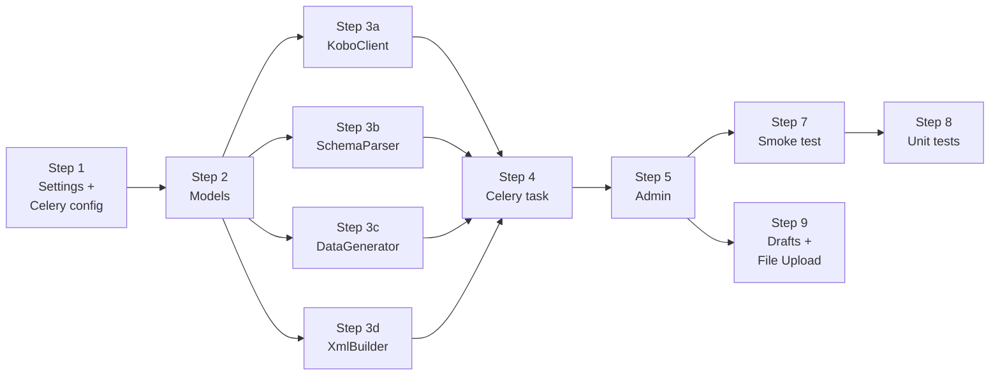

# Dummy Generator — Implementation Plan

## Prerequisites

Install dependencies:
```bash
pip install django requests Faker python-dotenv celery redis flower gunicorn
```

`requirements.txt`:
```
django>=5.2
requests>=2.32
Faker>=26.0
python-dotenv>=1.0
celery>=5.4
redis>=5.0
flower>=2.0
gunicorn>=22.0
```

Create `.env` in project root (gitignored):
```dotenv
KOBO_BASE_URL=https://kf.kobotoolbox.org
KOBO_KC_URL=https://kc.kobotoolbox.org
KOBO_USERNAME=your_username
KOBO_PASSWORD=your_password

CELERY_BROKER_URL=redis://redis:6379/0
CELERY_RESULT_BACKEND=redis://redis:6379/0
```

---

## Dependency Order



Steps 3a–3d are independent and can be written in parallel.

---

## Implementation Steps

### Step 1 — Settings + Celery Config

**`koboapi/settings.py`**

- [ ] Register `dummygenerator` in `INSTALLED_APPS`
- [ ] Add `load_dotenv()` call at module top
- [ ] Add Celery settings block:

```python
import os
from dotenv import load_dotenv
load_dotenv()

INSTALLED_APPS = [
    ...
    "dummygenerator",
]

CELERY_BROKER_URL = os.environ.get("CELERY_BROKER_URL", "redis://localhost:6379/0")
CELERY_RESULT_BACKEND = os.environ.get("CELERY_RESULT_BACKEND", "redis://localhost:6379/0")
CELERY_TASK_SERIALIZER = "json"
CELERY_RESULT_SERIALIZER = "json"
CELERY_ACCEPT_CONTENT = ["json"]
```

**`koboapi/celery.py`** (new file)

- [ ] Create Celery app instance:

```python
import os
from celery import Celery

os.environ.setdefault("DJANGO_SETTINGS_MODULE", "koboapi.settings")
app = Celery("koboapi")
app.config_from_object("django.conf:settings", namespace="CELERY")
app.autodiscover_tasks()
```

**`koboapi/__init__.py`**

- [ ] Import Celery app so Django loads it on startup:

```python
from .celery import app as celery_app
__all__ = ("celery_app",)
```

**Acceptance**: `python manage.py check` passes without errors.

---

### Step 2 — Models (`dummygenerator/models.py`)

- [ ] Define `STATUS_CHOICES` constant
- [ ] Define `SubmissionJob` with all fields including `celery_task_id`, `schema_snapshot`, and `field_faker_map` (JSONField, default=dict)
- [ ] Define `SubmissionLog` with FK to `SubmissionJob`
- [ ] Run `python manage.py makemigrations dummygenerator`
- [ ] Run `python manage.py migrate`

**Acceptance**: `python manage.py migrate` completes; both tables exist in `db.sqlite3`.

---

### Step 3 — Services (`dummygenerator/services.py`)

#### 3a — `KoboClient`

- [ ] `__init__` reads credentials from `os.environ`
- [ ] `fetch_schema(form_uid)` — GET `/api/v2/assets/{uid}/?format=json`, raises `HTTPError` on failure
- [ ] `submit_xml(xml_bytes)` — POST multipart to `kc_url/api/v1/submissions`, returns `(status_code, text)`

**Acceptance**: `KoboClient().fetch_schema("a3ytas3GLhSewNTZByCCsd")` returns dict with `content.survey`.

#### 3b — `SchemaParser`

- [ ] `parse_schema(api_response)` iterates `content.survey`
- [ ] Tracks open group via stack; handles `begin_group` / `end_group`
- [ ] Places `start` / `end` in `__root__` group
- [ ] Skips: `image`, `audio`, `video`, `file`, `note`, `begin_repeat`, `end_repeat`
- [ ] Builds `choices_map` from `content.choices` indexed by `list_name`
- [ ] Returns dict matching `schema_snapshot` structure

**Acceptance**: Parsing `docs/kobo-forms/iks.json` produces 4 named groups + `__root__`, and `choices_map` has 6 list names (`do2ug34`, `bz2rx27`, `bu8bi51`, `du7ql49`, `xq24n12`, `fg74l33`, `yc7cj58`, `lh9ot52`).

#### 3c — `DataGenerator`

- [ ] Define `FAKER_TYPE_CHOICES` constant (list of `(key, label)` tuples — 13 entries)
- [ ] `__init__` accepts `choices_map` and optional `locale`
- [ ] `generate(field_type, list_name, faker_type=None)` dispatches to typed methods
- [ ] `_faker_dispatch(faker_type)` maps each `FAKER_TYPE_CHOICES` key to a Faker call
- [ ] Implements: `text` (calls `_faker_dispatch` if `faker_type` set, else `faker.sentence()`), `integer`, `decimal`, `select_one`, `select_multiple` (random 1–N from full pool), `date`, `datetime`, `geopoint`, `start`, `end`
- [ ] Unknown types return `""`

**Acceptance**: `generate` returns non-empty string for all supported types; `select_one` output is always a member of the choices list.

#### 3d — `XmlBuilder`

- [ ] `build_submission_xml(form_uid, version_id, groups, field_values)` using `xml.etree.ElementTree`
- [ ] Creates `<data id=... version=...>` root
- [ ] Wraps each named group's fields in `<{group_name}>` element
- [ ] Renders `__root__` fields directly under `<data>`
- [ ] Omits fields with empty values
- [ ] Appends `<meta><instanceID>uuid:{uuid4}</instanceID></meta>`
- [ ] Returns UTF-8 encoded bytes

**Acceptance**: Output parses as valid XML; `<data id>` matches `form_uid`; group elements are correctly nested.

---

### Step 4 — Celery Task (`dummygenerator/tasks.py`)

- [ ] Create `run_submission_task(self, job_id)` as `@shared_task(bind=True)`
- [ ] Load `SubmissionJob` from DB by `job_id`
- [ ] Guard: return early if `status != "running"`
- [ ] Load `schema_snapshot` and `field_faker_map`, instantiate `KoboClient` and `DataGenerator`
- [ ] Loop `count_requested` times:
  - Generate all field values — pass `faker_type=field_faker_map.get(field_name)` for each field
  - Build XML
  - Submit via `KoboClient`
  - Create `SubmissionLog` entry
  - Increment `count_succeeded` or `count_failed`
- [ ] On `ConnectionError`: set `status = "failed"`, stop loop
- [ ] On finish: set `status = "done"` or `"partial"`, set `completed_at`, save job
- [ ] Return summary dict `{"succeeded": n, "failed": n}`

**Acceptance**: Calling `run_submission_task.apply(args=[job_id])` synchronously processes the job and updates `SubmissionJob.status`.

---

### Step 5 — Admin (`dummygenerator/admin.py`)

- [ ] Register `SubmissionJob` and `SubmissionLog`
- [ ] `SubmissionJobAdmin`:
  - `list_display` = `form_uid`, `count_requested`, `count_succeeded`, `count_failed`, `status`, `celery_task_id`, `created_at`
  - `readonly_fields` = `status`, `count_succeeded`, `count_failed`, `celery_task_id`, `completed_at`, `schema_snapshot`
  - Override `save_model`:
    - On new job: call `KoboClient().fetch_schema(form_uid)` → `parse_schema()` → assign `schema_snapshot`
    - Wrap in `try/except requests.HTTPError` → raise `ValidationError` with message
  - **Field Faker Configuration widget** (custom `change_form` template section):
    - Reads `schema_snapshot.groups` to render a table of all fields
    - Text fields → `<select>` dropdown from `FAKER_TYPE_CHOICES`; pre-selected from `field_faker_map`
    - Non-text fields → read-only type label, no dropdown
    - On save: extract POST values for text fields → write into `field_faker_map` on the job instance
- [ ] Action `run_bulk_submission`:
  - Skip jobs not in `pending`; show admin warning per skipped job
  - Set `status = "running"`, save
  - Call `run_submission_task.delay(job.id)`
  - Store returned `task.id` in `celery_task_id`, save
  - Show success message: `"Job {id} queued — task {task_id}"`
- [ ] Action `refresh_schema`:
  - Re-fetch and overwrite `schema_snapshot` on selected jobs
  - Show confirmation count message

**Acceptance**: Creating a job in admin stores populated `schema_snapshot`. Running the action sets `celery_task_id` and returns immediately.

---

### Step 7 — Smoke Test Against IKS Form

- [ ] Log into Django admin at `localhost:8000/admin/`
- [ ] Create `SubmissionJob`: `form_uid = a3ytas3GLhSewNTZByCCsd`, `count_requested = 3`
- [ ] Verify `schema_snapshot` is populated after save (visible in read-only field)
- [ ] Select job → run "Run bulk submission" action
- [ ] Verify job shows `status = running` then `done`, `count_succeeded = 3`
- [ ] Verify `celery_task_id` is populated
- [ ] Open Flower at `localhost:5555` → confirm task shows `SUCCESS`
- [ ] Log into KoboToolbox → confirm 3 new submissions appear in the IKS form data

---

### Step 8 — Unit Tests (`dummygenerator/tests.py`)

- [ ] `test_parse_schema_iks` — load `docs/kobo-forms/iks.json`, parse, assert 4 groups + `__root__`, 8 list names in `choices_map`
- [ ] `test_data_generator_select_one` — assert returned value is a member of the choices list
- [ ] `test_data_generator_select_multiple` — assert all space-separated tokens are valid choices
- [ ] `test_data_generator_text` — assert non-empty string returned
- [ ] `test_build_submission_xml_structure` — parse output XML, assert `<data id>`, group elements, `<meta>` present
- [ ] `test_build_submission_xml_skips_empty` — fields with `""` value must not appear in XML
- [ ] `test_run_submission_task_success` — mock `submit_xml` returning `(201, "")`, assert `count_succeeded = job.count_requested`
- [ ] `test_run_submission_task_partial` — mock first call `(201, "")`, rest `(500, "err")`, assert `status = "partial"`

---

### Step 9 — Manual Drafts + File Upload

#### 9a — Models (`dummygenerator/models.py`)

- [ ] Add `SubmissionDraft` with fields: `job` FK, `field_values` JSONField (non-file fields pre-filled), `status` CharField (`pending / submitted / skipped`), `created_at`
- [ ] Add `DraftAttachment` with fields: `draft` FK, `field_name` CharField(128), `file` FileField(`upload_to='draft_attachments/'`)
- [ ] Run `python manage.py makemigrations dummygenerator` + `migrate`

**Acceptance**: Both tables exist; `DraftAttachment.file` stores uploaded files under `draft_attachments/`.

#### 9b — Services (`dummygenerator/services.py`)

- [ ] Update `SchemaParser`: remove `image`, `audio`, `video`, `file` from the skip list; mark retained fields with `"is_file": True` in the field dict
- [ ] Update `KoboClient.submit_xml(xml_bytes, attachments={})`: add attachment bytes as extra multipart parts (key = filename, value = bytes)
- [ ] Update `XmlBuilder`: for `is_file` fields, write `<field_name>{filename}</field_name>` using the original filename; skip field entirely if no attachment provided

**Acceptance**: `build_submission_xml` includes file field elements when a filename is supplied and omits them when not. `submit_xml` sends files as additional multipart parts alongside the XML.

#### 9c — Admin (`dummygenerator/admin.py`)

- [ ] Register `SubmissionDraft` with `DraftAttachmentInline` (tabular, `extra=0`)
- [ ] `SubmissionDraftAdmin`: `list_display` = `job`, `status`, `created_at`; inline for attachments; `readonly_fields` = `status`, `created_at`
- [ ] Add `generate_drafts` action to `SubmissionJobAdmin`:
  - Creates N `SubmissionDraft` rows (N = `count_requested`)
  - Pre-fills `field_values` using `DataGenerator` for all non-file fields
  - File fields left empty — user uploads manually via inline
  - Shows message: `"N drafts created for job {id}"`
- [ ] Add `submit_drafts` action to `SubmissionDraftAdmin`:
  - Skips drafts not in `pending`; warns per skip
  - For each pending draft: reads `field_values` + `DraftAttachment` files, builds XML, calls `submit_xml` with attachments, creates `SubmissionLog`, marks `submitted`
  - Updates parent `SubmissionJob.count_succeeded` / `count_failed`

**Acceptance**: Creating a job with an image field, running "Generate drafts", uploading a file via `DraftAttachmentInline`, and running "Submit drafts" produces HTTP 201 in KoboToolbox with the image attached.

---

## File Checklist

```
koboapi/
├── koboapi/
│   ├── settings.py       ← Step 1 (INSTALLED_APPS, Celery settings, load_dotenv)
│   ├── celery.py          ← Step 1 (new)
│   └── __init__.py        ← Step 1 (import celery_app)
├── dummygenerator/
│   ├── models.py          ← Step 2
│   ├── services.py        ← Step 3 (KoboClient, SchemaParser, DataGenerator, XmlBuilder)
│   ├── tasks.py           ← Step 4 (new)
│   ├── admin.py           ← Step 5
│   ├── tests.py           ← Step 8
│   └── migrations/
│       └── 0001_initial.py
├── .env                   ← created manually, gitignored
└── requirements.txt       ← updated in Prerequisites
```
